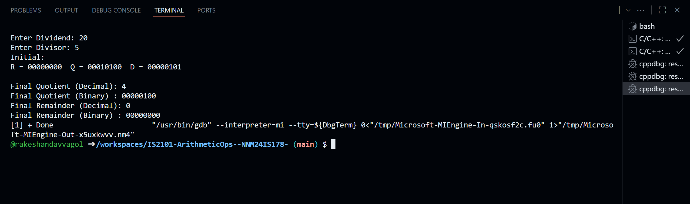

# IS2101-ArithmeticOps--NNM24IS178-  
C programs for signed integer multiplication and division algorithms  

This repository contains C programs that implement three basic arithmetic algorithms:  

1. **Sequential (Shift-Add) Multiplication**  
   - Works with signed integers using 2’s complement.  
   - Shows the step-by-step shift and add process.  

2. **Restoring Division Algorithm**  
   - Performs division on positive integers.  

3. **Non-Restoring Division Algorithm**  
   - Similar to restoring division but avoids the restore step by using non-restoring logic.  
   - Displays each step clearly (accumulator, dividend, and quotient bits).  

These programs demonstrate how multiplication and division are carried out inside computer hardware.  
They also show how time complexity can be reduced (for example, using **non-restoring** instead of **restoring** division).  

---

## File Structure  
- `ShiftAddMultiplication.c` – Code for sequential multiplication  
- `RestoringDivision.c` – Code for restoring division  
- `Non_Restoring_Algorithm.c` – Code for non-restoring division  
- `README.md` – Project details and instructions  

---

## Compilation and Execution  
```bash
gcc ShiftAddMultiplication.c -o ShiftAddMultiplication
./ShiftAddMultiplication

gcc RestoringDivision.c -o RestoringDivision
./RestoringDivision

gcc Non_Restoring_Algorithm.c -o NonRestoring
./NonRestoring

```
## Output of Shift-Add Multiplication


## Output of Restoring Division


## Output of Non-Restoring Division

